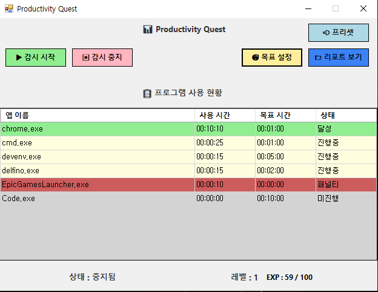
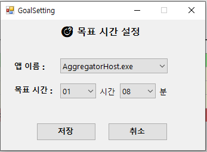
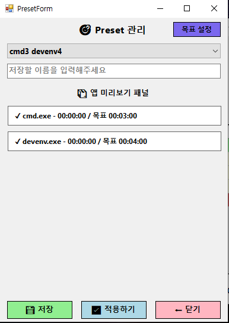
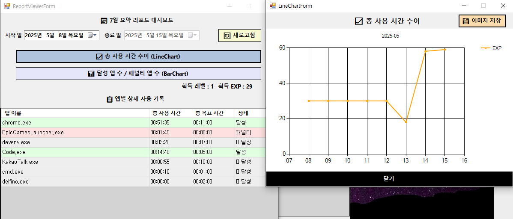
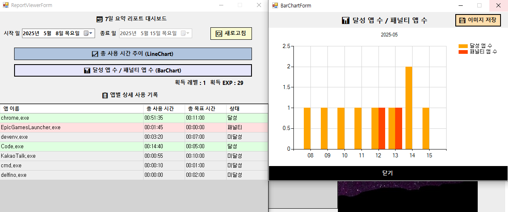

# 🧠 ProductivityQuest

**앱 사용 습관을 게임처럼 추적하고 성장시키는 Windows 생산성 앱**

> 목표를 설정하고, 앱을 사용하면서 EXP를 획득하세요.  
> 습관을 만드는 가장 쉬운 방법입니다.

---

## 📸 스크린샷

### 👁‍🗨 메인 대시보드


### 🎯 목표 설정
| 목표 설정 | 프리셋 |
|---------------|-------------|
|  |  |

### 📊 주간 리포트
| LineChart | BarChart |
|---------------|-------------|
|  |  |

<br>

## 🔗 Links  
- [📘 발표 자료(노션)]()  

---

## 📘 프로젝트 개요  
기간: 2025.05.07 ~ 2025.05.16  

**ProductivityQuest**는 사용자가 컴퓨터에서 어떤 앱을 얼마나 오래 사용했는지를 자동으로 추적하고,  
그 사용량을 기반으로 EXP(경험치)를 보상으로 제공하는 **게이미피케이션 기반 생산성 추적 도구**입니다.

앱별로 목표 시간을 설정하고, 이를 달성할 경우 EXP를 얻고 레벨업하며,  
패널티 앱 사용 시 감점되는 등 습관 형성에 도움을 줍니다.

### 🎯 제작 배경  
프로그래머, 디자이너, 크리에이터 등 많은 사람들이  
“시간 관리”를 원하지만 **지속적인 자기 통제는 어렵습니다.**

**"게임처럼 즐기며 습관을 만들 수 없을까?"** 라는 고민에서 출발한 이 프로젝트는  
"감시받는 느낌 없이 자연스럽게 추적되고,  
달성했을 때 보상을 받고,  
결과가 리포트로 쌓이는 앱"을 목표로 개발되었습니다.

### 🛠 기술 스택  
- C# / Windows Forms (.NET Framework 4.7.2)
- Newtonsoft.Json
- System.Diagnostics (프로세스 추적)
- 배포: 

---

## 📦 설치 / 실행
1. Visual Studio 2022 이상으로 프로젝트 열기
2. `MainDashboardForm.cs`를 시작 폼으로 설정
3. `F5` 또는 `Ctrl + F5`로 실행
4. 설정된 앱을 감시하고 리포트를 확인하세요

---

## ✨ 주요 기능  
- 앱별 목표 시간 설정
- 사용 시간 실시간 추적
- 목표 달성 시 EXP 획득 & 레벨 업
- 패널티 앱 자동 감점
- 프리셋 저장 / 불러오기
- 주간 리포트 (LineChart & BarChart)

---

### 📁 폴더 구조
```
ProductivityQuest/
├── Models/
│ ├── AppUsage.cs
│ ├── RawReportEntry.cs
│ └── UserProfile.cs
├── Services/
│ ├── AppUsageStorage.cs
│ ├── LevelCalculator.cs
│ ├── ProcessTracker.cs
│ ├── ProfileManager.cs
│ └── ReprotExporter.cs
├── MainDashboardForm.cs
├── GoalSettingForm.cs
├── PresetForm.cs
├── ReportViewerForm.cs
├── LineChartForm.cs
├── BarChartForm.cs
└── README.md
```

## 📁 실행 예시 결과물
- 리포트: `/Reports/YYYY-MM-DD.json`
- 프리셋: `/presets/set1.json`

---

## ✅ 추후 작업 및 이슈
- 🔁 기능 개선 : 프리셋 이름 수정 / 삭제 기능 추가, 앱별 누적 사용 통계 별도 그래프화, 달성 상태에 따른 주간 성취도 요약(75%)
- 🧪 정확성 강화 : 프로세스 감지 예외 처리 강화 (System Idle 등 필터링)
- 🗃 데이터 관리 : 리포트 내 특정 앱만 필터링하여 보기
---

## 📃 라이선스

MIT License © 2025 [thusja]

